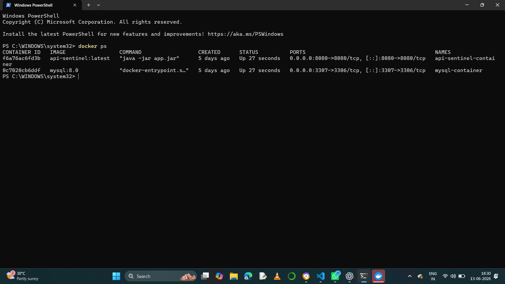
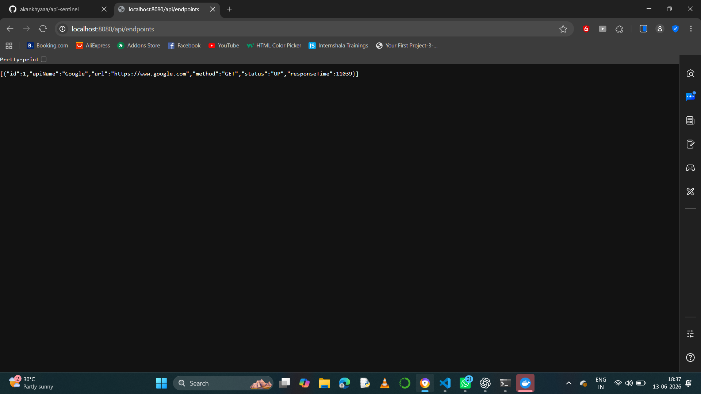
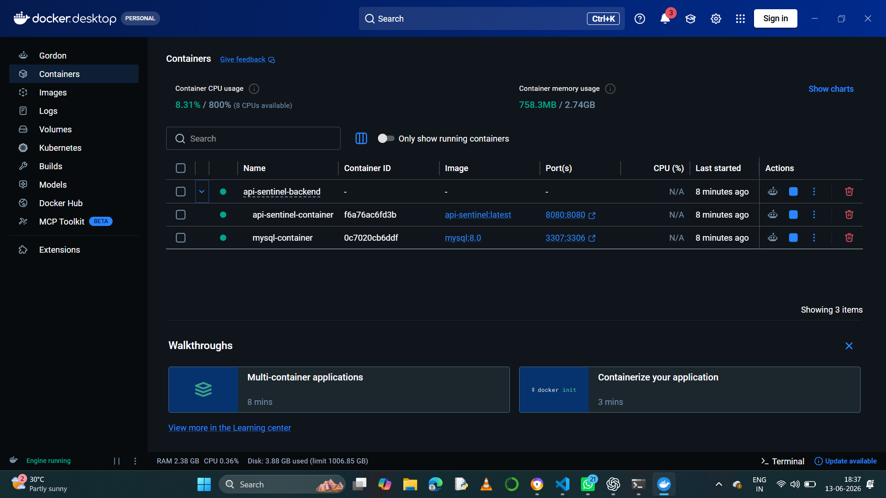
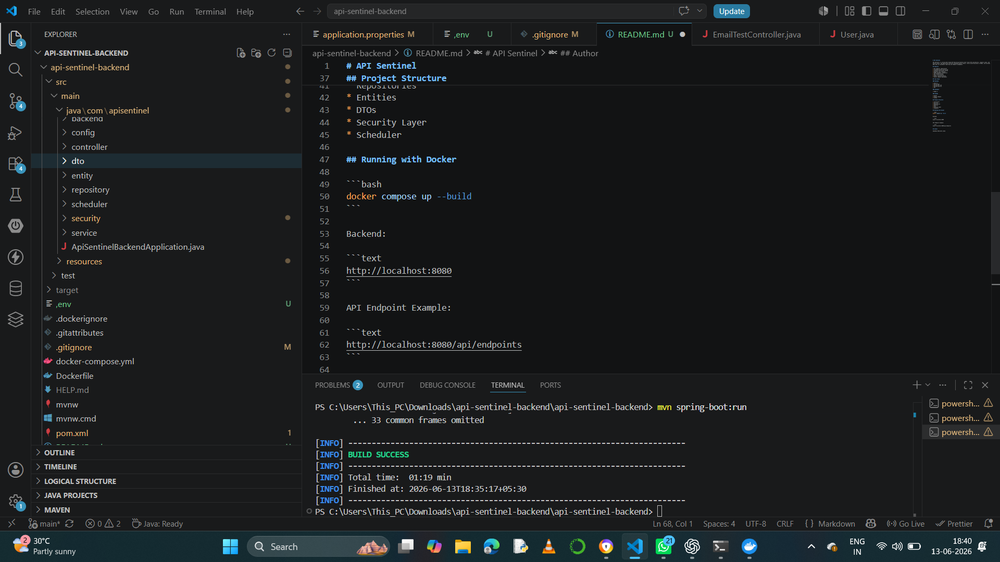

# API Sentinel

API Sentinel is a Spring Boot based API Monitoring Platform that tracks API availability, response times, and health status. The application performs automated health checks, stores monitoring data in MySQL, and provides REST APIs for dashboard reporting and endpoint management.

## Features

* API endpoint registration
* Automated health monitoring
* Scheduled API health checks
* Response time tracking
* MySQL database integration
* JWT Authentication
* Email notifications
* Docker containerization
* Docker Compose deployment

## Tech Stack

### Backend

* Java 17
* Spring Boot
* Spring Data JPA
* Spring Security
* JWT

### Database

* MySQL 8

### DevOps

* Docker
* Docker Compose
* GitHub

## Project Structure

* Controllers
* Services
* Repositories
* Entities
* DTOs
* Security Layer
* Scheduler

## Running with Docker

```bash
docker compose up --build
```

Backend:

```text
http://localhost:8080
```

API Endpoint Example:

```text
http://localhost:8080/api/endpoints
```
## Screenshots

### Running Containers



### API Response



### Docker Desktop



### Project Structure



## Author

Akankhya Abhisikta Lenka


